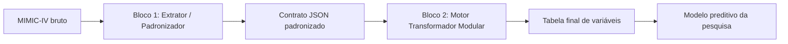
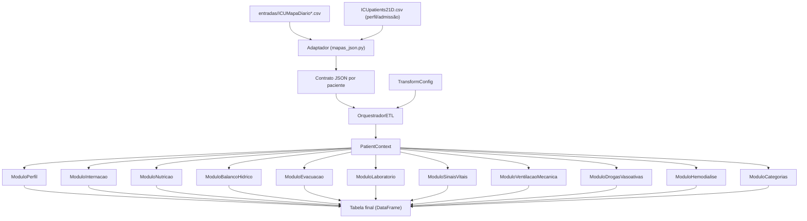

# Arquitetura da Solução

## Visão geral

A solução completa é composta por dois blocos:

- **Bloco 1 (Extrator/Padronizador):** extrai dados brutos do MIMIC-IV, gera mapas diários por variável clínica e produz o contrato JSON padronizado. Fora do escopo do protótipo funcional.
- **Bloco 2 (Motor Transformador Modular):** recebe o contrato JSON, aplica as regras clínicas por módulo e produz a tabela final de variáveis para o modelo preditivo. **Este bloco é o protótipo implementado.**

## Bloco 2 — Arquitetura interna

## Arquivos de entrada

| Arquivo | Papel | Obrigatório |
|---|---|---|
| `entradas/ICUMapaDiario*.csv` | Mapas diários por variável clínica (30 arquivos) | Sim — fluxo principal (API + painel) |
| `ICUpatients21D.csv` | Perfil do paciente: peso, altura, idade, intime, outtime, deathtime | Sim |
| `ICUNewWindow24.csv` | Janelas de 24h consolidadas — fluxo alternativo via `main.py` | Não (legado/CLI) |

> O painel React e a API Flask usam exclusivamente o fluxo `entradas/` via `mapas_json.py`.
> O `ICUNewWindow24.csv` é mantido apenas como alternativa para execução direta via `main.py --all`.

## Stack de deploy

| Componente | Tecnologia |
|---|---|
| Motor ETL | Python 3.11 + Pandas |
| API REST | Flask + Gunicorn |
| Painel do usuário | React (Vite) |
| Painel admin | React (Vite) |
| Proxy reverso | Nginx (HTTPS, porta 443) |
| Containerização | Docker + Docker Compose |

**URLs locais:**
- Painel usuário: `https://localhost/`
- Painel admin: `https://localhost/painel/`
- API: `https://localhost/api/`

## Módulos do Bloco 2

| Módulo | Variáveis fornecidas |
|---|---|
| ModuloPerfil | cSexo, cFaixaEtaria, cFaixaIMC |
| ModuloInternacao | cDiasEmUTI, cDesfechoEmUTI |
| ModuloNutricao | nMediaKcalKgDia*, nMediaGKgDia*, nPropDiasJejum*, cInicioNutri, cInicioProteinas, cInicioCalorias |
| ModuloBalancoHidrico | cSinalSomaBH*, cTendenciaBH*, cPropDiasBHPositivo, nPropDiasBHPositivo |
| ModuloEvacuacao | cFreqDiarreia, nPropDiasDiarreia |
| ModuloLaboratorio | nPropDias* (albumina, bilirrubina, creatinina, ureia, hemoglobina, linfócitos, triglicérides, potássio, magnésio, sódio, fósforo, pH, lactato, plaquetas, WBC, AST, ALT, fosfatase alcalina) |
| ModuloSinaisVitais | cPropDiasTempCorpElevada, nPropDiasPAS/PAD/PAM*, nPropDiasPH*, nPropDiasHGT* |
| ModuloVentilacaoMecanica | cInicioVM, cVMReintubacao, cVMTempoDesmame, nPropDiasVM |
| ModuloDrogasVasoativas | nPropDiasSemUsoNora, nPropDiasNoraMax025/050/050Mais, nPropDiasUsoVaso |
| ModuloHemodialise | cPropDiasHemodialise, nPropDiasHemodialise |
| ModuloCategorias | cProp* — categorização 0-4 de todas as variáveis numéricas acima |

*Variáveis que dependem de dados de perfil (peso) para cálculo completo.

## Regras de categorização

A maioria das variáveis categóricas `c` é derivada de `n` via `_cat()`:

| Intervalo de n | Categoria |
|---|---|
| 0 | 0 |
| (0, 0,25] | 1 |
| (0,25, 0,50] | 2 |
| (0,50, 0,75] | 3 |
| > 0,75 | 4 |

**Exceção — `cPropDiasSemUsoNora`:** usa escala invertida `4 - _cat(n)`, pois alto
valor de `nPropDiasSemUsoNora` (muitos dias sem noradrenalina) indica menor gravidade,
correspondendo à categoria 0. Equivale a aplicar `_cat()` sobre a proporção de dias
**com** noradrenalina.

## Validação

O sistema compara a saída do motor com `BASEPACIENTES21D_amostra_atualizado.csv`
(9 pacientes extraídos da base de referência completa da professora). A comparação
usa arredondamento em 1 casa decimal e é robusta a separadores decimais BR (vírgula)
e internacionais (ponto).
