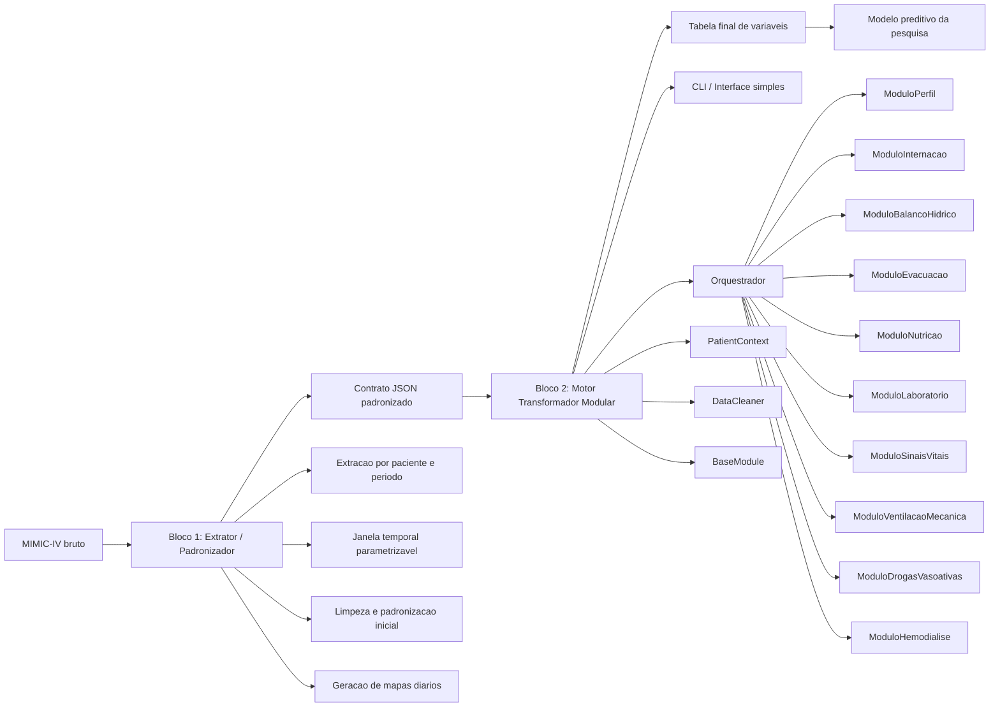

# Arquitetura da Solucao

## Escopo do MVP

O MVP implementa o Bloco 2. O Bloco 1 fica descrito na arquitetura completa e
sera responsavel por criar os mapas temporais a partir do MIMIC-IV bruto.

Os modulos do Bloco 2 fazem parte do escopo do MVP. Quando a entrada ainda nao
fornece determinado dominio clinico, o modulo retorna valores neutros de ausencia
de anotacao, mantendo o contrato de saida estavel.

## Interface simples

A interface do MVP deve apenas receber o JSON e os parametros de processamento,
chamar o motor transformador e exibir a saida. As regras clinicas permanecem no
back-end Python.
